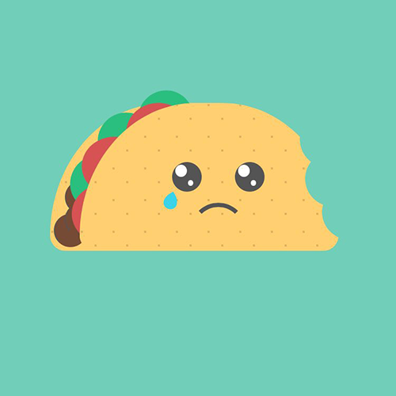
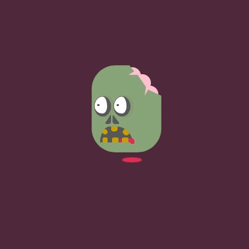
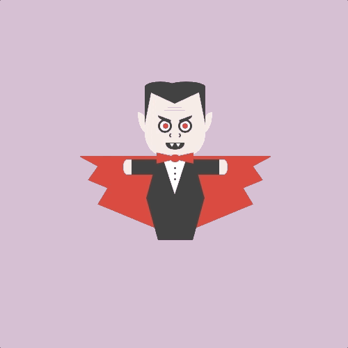
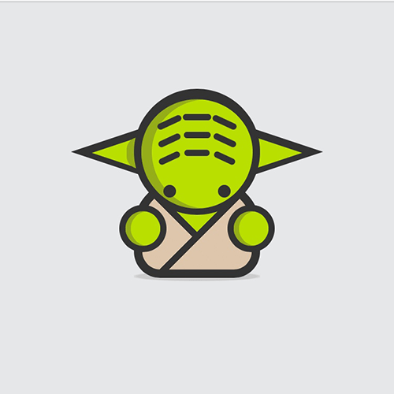
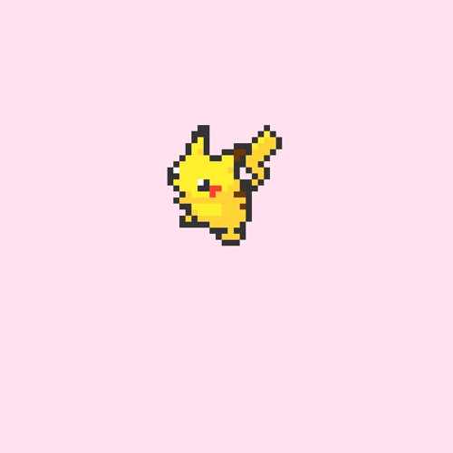
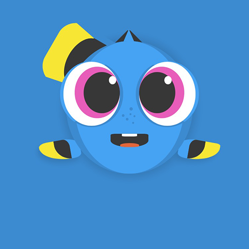

# Daily CSS Images Collection

This is a collection of the CSS images that I made for the [#DailyCSSImages](http://dailycssimages.com) challenge.

You can also view them on my [codepen](https://codepen.io/vicbergquist/pens/public/) profile.

## Some examples

